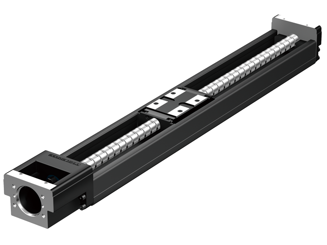
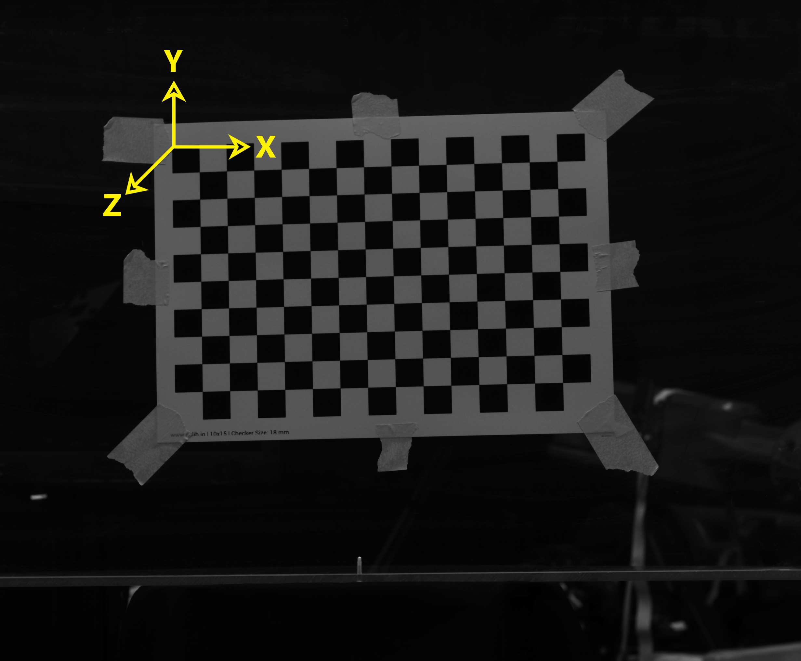
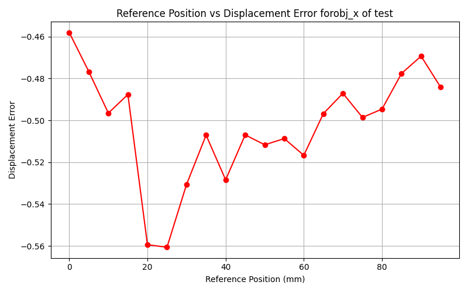
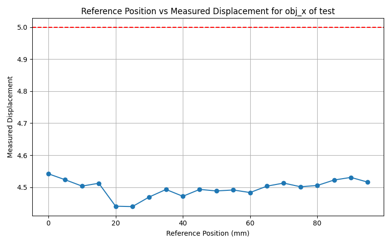

# Motorized Stage Error Estimation (MSEE) - (Position) for THK SKR3306A Linear Stage

_This file will explain the steps necessary to successfully estimate the positional error for linear stage THK SKR3306A._

<p align="center">

</p>
<p align="center"><em>Image source: [https://www.thk.com/]</em></p>

---
## Test Setup

* For this test I have used a LMK 6-5 Color Camera with a 25mm objective to capture the images mounted on the stage.
* The Checkerboard pattern is printed on a regular A4 sheet paper using a laser printer with black toner.
* The pattern is stuck to a acrylite plate using masking tape, which firmly holds it to the position.
* The images are captured at a displacement interval of 5mm each.

## Steps to follow for peforming MSEE

* You will be prompted to enter the various parameters necessary for error estimation:

```
 Enter chessboard size (row,col): 9,14

 Enter the size of chessboard square in mm: 18

 Enter the image format (e.g., 'png' or 'jpg'): png

 Select the direction in which the images are captured:
 1. Origin to End position
 2. End position to Origin
 Enter your choice (1 or 2): 2
 
```
>The selection of direction is provided to give flexibility to the user to select their preffered direction for calculation of the error. 
>
>>For example, to avoid the effect of backlash in gear the drive is made from  target position to origin of the stage. In that case you would like to select choice no 2.

```
Do you want to perform extended analysis? (y/n): y

Extended Analysis

    Enter the stage name: test

    Enter the displacement step (mm): 5

    Select the axis under investigation:
    1. X_theta
    2. Y_theta
    3. Z_theta
    4. obj_x
    5. obj_y
    6. obj_z
    7. R_cam_X_theta
    8. R_cam_Y_theta
    9. R_cam_Z_theta
    10. cam_x
    11. cam_y
    12. cam_z

    Enter the number corresponding to the axis: 4
    You selected: obj_x

    Enter the starting position (mm): 100
```
* It should provide a result like this:
```
Average Percentage Error: 10.06%
```
## Notes

1. In order to identify the correct axis corresponding to your stage it is necessary to identify the axis notation of the checkerboard. In the following picture you can identify the axis notation for the checker board.

<p align="center">

</p>
<p align="center"><em>Image source: Test_Images </em></p>

2. So by identifying the direction in which the checker board moves you can select the appropriate axis from the list of available axis.
3. In most cases you would be tempted to track the extrinsic parameters of camera, as it moves while the target object (checker board) remains stationary, but it is recommended that you use the target object parameters as they provide better estimation as compared to camera extrinsic simply because the homography is peformed on the features of the target object and based on its estimated extrinsic the camera's pose and real world coordinates are approximated.
4. Results are saved in a excel file: sample result

| ref_pos  | obj_x     | measured displacement |displacement_error | percentage_error|
| -------- |:---------:| :------------------:| :------------------:|:---------------:|
100 | 135.6964606 | 0 | -5 | -100
95 | 131.1806404 | 4.515820118 | -0.484179882 | -9.683597649
90 | 126.6500084 | 4.530632051 | -0.469367949 | -9.38735899
85 | 122.1275933 | 4.522415134 | -0.477584866 | -9.55169732
80 | 117.6222409 | 4.50535236 | -0.49464764 | -9.892952796
75 | 113.1208572 | 4.50138374 | -0.49861626 | -9.972325194
70 | 108.6079643 | 4.512892889 | -0.487107111 | -9.742142217
65 | 104.104754 | 4.503210292 | -0.496789708 | -9.935794151
60 | 99.62147076 | 4.483283216 | -0.516716784 | -10.33433568
55 | 95.13019602 | 4.491274745 | -0.508725255 | -10.1745051
50 | 90.64189267 | 4.488303346 | -0.511696654 | -10.23393309
45 | 86.14883491 | 4.493057761 | -0.506942239 | -10.13884478
40 | 81.67725094 | 4.471583973 | -0.528416027 | -10.56832055
35 | 77.18433412 | 4.492916822 | -0.507083178 | -10.14166355
30 | 72.71495642 | 4.469377698 | -0.530622302 | -10.61244603
25 | 68.27556901 | 4.439387405 | -0.560612595 | -11.21225189
20 | 63.83499081 | 4.440578204 | -0.559421796 | -11.18843592
15 | 59.32265714 | 4.512333676 | -0.487666324 | -9.753326484
10 | 54.81919741 | 4.503459723 | -0.496540277 | -9.930805537
5 | 50.29592168 | 4.523275733 | -0.476724267 | -9.534485335
0 | 45.75399929 | 4.541922392 | -0.458077608 | -9.161552155

5. The plots are displayed as follows:

<div style="display: flex; justify-content: left;">
  
  
</div>
